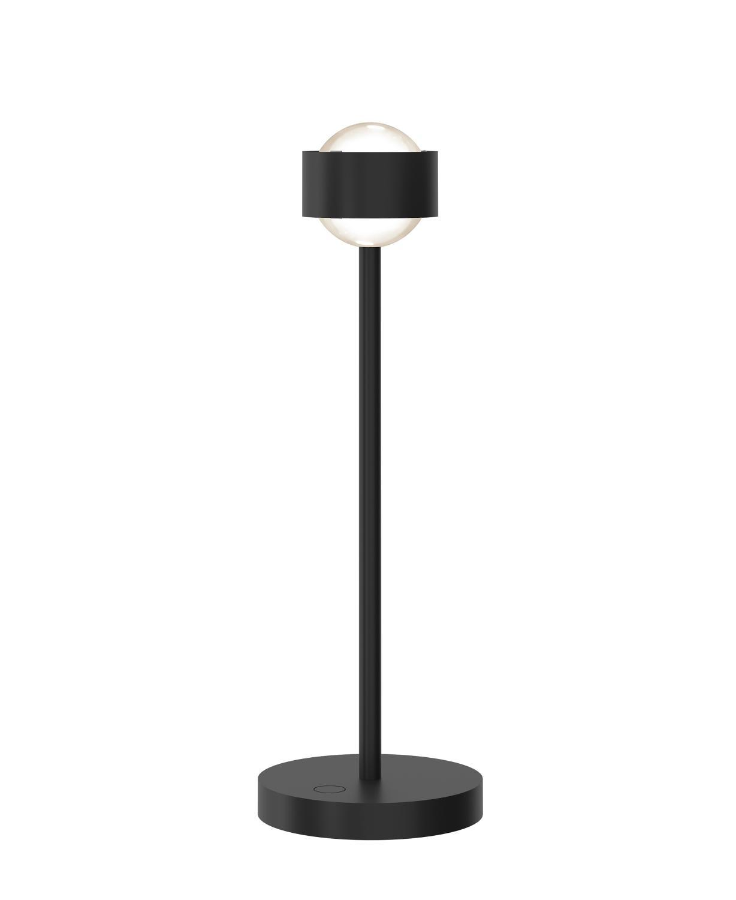

# Eye of the Table

Just another experiment, now using Clerk for authentication.

## Getting Started

1. Install dependencies using `pnpm install`.
2. Start the development server with `pnpm run dev`.
